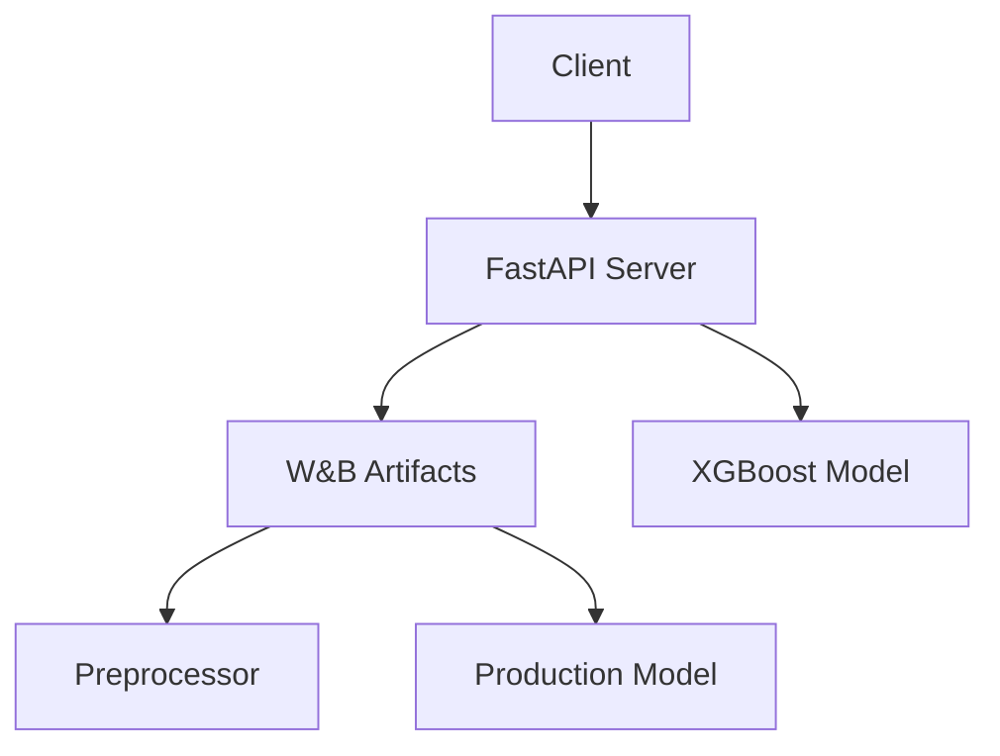

# Fraud Detection ML Deployment System


A production-grade machine learning deployment system for fraud detection with full ML lifecycle management.

## Key Components 

- **Model Serving**: FastAPI endpoints for real-time predictions.
- **Model Management**: W&B integration for version control and experiment tracking.
- **Validation**: Strict input validation using Pydantic models.
- **Monitoring**: Built-in traffic simulation, logging, and model performance tracking.
- **Containerization**: Dockerized deployment for easy scaling.

## Weights & Biases (W&B) Integration 

### Core Functions:
1. **Model Versioning**
   - Store production-ready models as artifacts in W&B.
   - Track model lineage, hyperparameters, and experiment history.
   - Rollback to previous versions when necessary.

2. **Artifact Management**
   - Version control for:
     - Trained models (`production_model.pkl`).
     - Preprocessing pipelines (`preprocessor.pkl`).
     - Feature engineering logic.
   - Example of artifact loading:
     ```python
     run = wandb.init(project=os.getenv('WANDB_PROJECT'), job_type="inference")
     artifact = run.use_artifact('production_model:latest', type='model')
     ```

3. **Production Monitoring**
   - Track prediction distributions, model performance, and system metrics during inference.
   - Monitor for model drift and take corrective actions if needed.

### W&B Setup Requirements:
Create a `.env` file with the following contents:
```
WANDB_API_KEY=your_api_key_here  # Obtain from wandb.ai/authorize
WANDB_PROJECT=fraud-detection-prod
```

## System Architecture 



## Installation & Setup 

### 1. Local Development

```bash
python -m venv venv
source venv/bin/activate
pip install -r requirements.txt
```

### 2. Docker Deployment

```bash
docker build -t fraud-detector:v1 .
docker run -p 9090:9090 --env-file .env fraud-detector:v1
```

## API Documentation 

### Prediction Request

`POST /predict/`
```json
{
  "amt": 245.5,
  "hour": 14,
  "day_of_week": 3,
  "category": "grocery"
}
```

### Response Schema
```json
{
  "prediction": "non-fraudulent",
  "fraud_probability": 0.03
}
```

### Health Check
```bash
curl http://localhost:9090/health
```

## Model Management Guide 

### Updating Production Models
1. Train a new model version.
2. Upload the new model to W&B:
   ```python
   with wandb.init(project="fraud-detection") as run:
       artifact = wandb.Artifact('production_model', type='model')
       artifact.add_file("model.pkl")
       run.log_artifact(artifact)
   ```
3. Update the artifact version in the W&B dashboard.

## Monitoring & Observability 

### Tracked Metrics:

| Metric Type | Examples                             | 
|-------------|--------------------------------------|
| **System**  | Response latency, Memory usage      |
| **Model**   | Prediction distributions, Feature importance |
| **Data**    | Input distributions, Missing values |

### Accessing W&B Dashboard:
During inference initialization:
```python
wandb.init(project=os.getenv('WANDB_PROJECT'), job_type="monitoring")
```

## Traffic Simulation 

Test different load scenarios:
- Basic Test:
  ```bash
  python test_script.py
  ```

- Heavy Load Scenario:
  ```bash
  python test_script.py --num_requests 1000 --delay 0.1
  ```

- Custom Endpoint Testing:
  ```bash
  export BASE_URL="https://your-production-endpoint"
  python test_script.py
  ```

## Security Best Practices 

1. **Secret Management**
   - Never commit `.env` files to version control.
   - Use Docker secrets for production environments.
   - Regularly rotate W&B API keys.

2. **Input Validation**
   - Hour: Must be between 0 and 23.
   - Day of Week: Must be between 0 and 6.
   - Amount: Must be a positive value.

## Troubleshooting Guide 

### Common Errors:

**W&B Authentication Error**
```
wandb: ERROR Failed to query server (500 response)
```
- Verify the API key validity.
- Check network connectivity.
- Test with `wandb login` in the CLI.

**Model Loading Failure**
```
FileNotFoundError: Pipeline file not found
```
- Verify the artifact exists in W&B.
- Check artifact version tags.
- Validate file paths in the artifact.

## Performance Optimization 

1. **Model Caching**
   - Cache loaded models in memory to avoid reloading during each inference request.
   - Implement a warm-up phase during startup to ensure the model is ready when the system starts.

2. **Async Processing**
   - Use asynchronous endpoints to handle concurrent prediction requests efficiently:
     ```python
     @app.post("/predict/")
     async def predict(request: PredictionRequest):
         # Async prediction logic
     ```

3. **Batch Predictions**
   - Implement a batch endpoint to process multiple transactions in one request.
